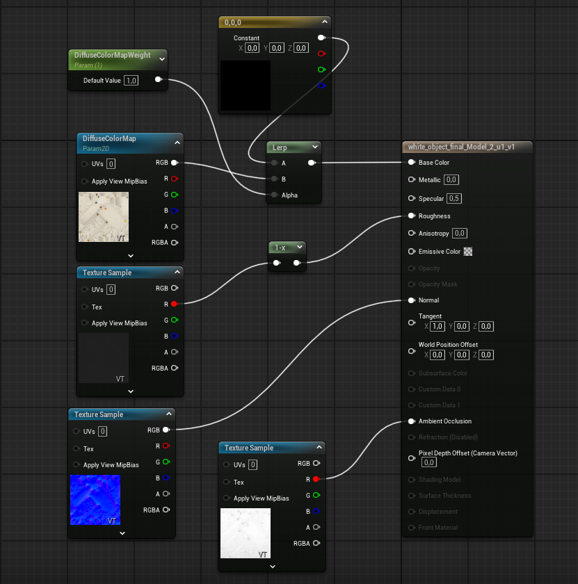

# 🧱 Generate Material Maps with Materialize

This tutorial walks you through generating additional texture maps for your 3D model using [Materialize](http://boundingboxsoftware.com/materialize/). These maps will enhance the visual quality of your model in rendering engines like Unreal Engine.

---

## 🖥️ Step 1: Install Materialize

Download and install Materialize (Windows-only):  
👉 http://boundingboxsoftware.com/materialize/

This tool lets you generate:

- Normal map  
- Height map  
- Roughness map  
- Ambient Occlusion (AO)  
...from just a diffuse texture.

---

## ▶️ Step 2: Learn the Interface

We recommend watching this clear video tutorial first:  
🎥 [How to Use Materialize (YouTube)](https://www.youtube.com/watch?v=I1yO0UlLnC4&t=24s)

It walks you through loading your diffuse map and generating the rest step by step.

---

## 🎨 Step 3: Export All Maps

Once you've generated your desired maps (Normal, Roughness, AO, etc.):

1. Save each map to your export directory  
2. Name them consistently:  
   - `model_diffuse.png`  
   - `model_normal.png`  
   - `model_roughness.png`  
   - `model_ao.png`  

These files are now ready for import into Unreal Engine.

---

## 🎮 Step 4: Import to Unreal Engine

1. Open your Unreal project.  
2. Import the mesh and all texture maps.  
3. In the Material editor:  
   - Connect each texture to the corresponding node:
     - BaseColor → Diffuse
     - Normal → Normal Map
     - Roughness → Roughness
     - Ambient Occlusion → AO

Once connected, your object will display realistic surface lighting.

---

## ✅ Final Result

