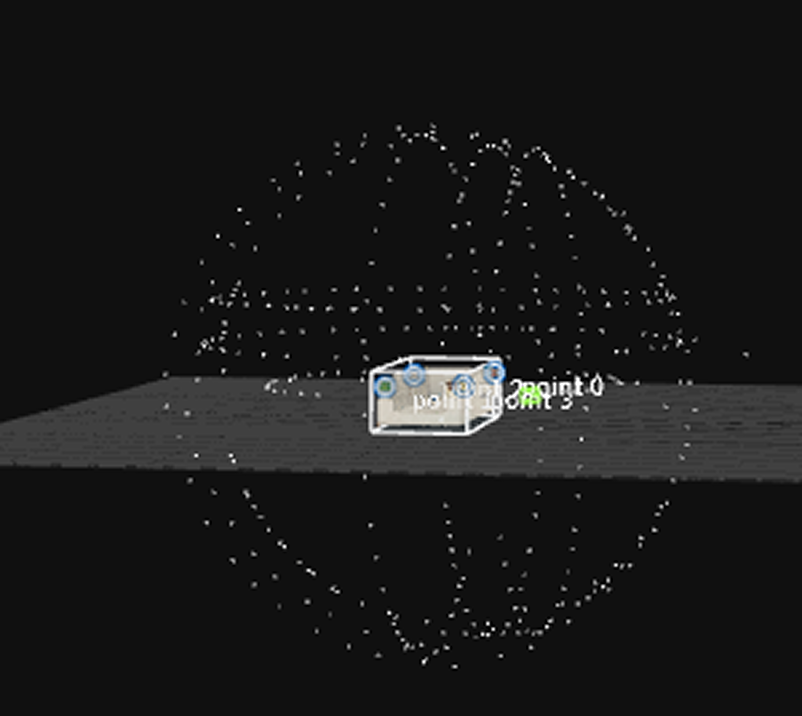
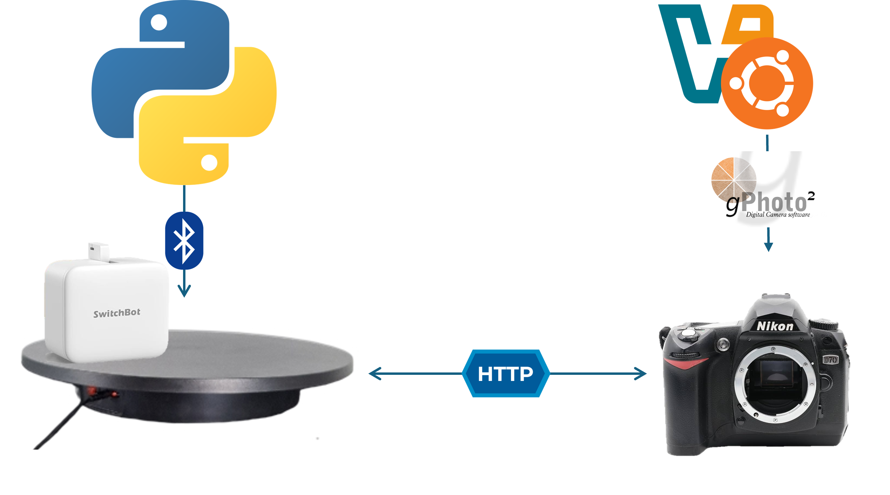

# 📸 Capture Dataset for 3D Reconstruction

This guide explains how to capture a 3D reconstruction dataset using an automated setup involving a DSLR camera, a rotating platform, and a SwitchBot controller.

---

## 🧩 Automation Overview

The following pipeline allows automatic performance of one loop of the object. At least several loops are needed for good 3D reconstruction. 
After one full rotation of the object, move the camera to a new position and do [Camera Set Up](setUpCamera.md).
You can change the orientation of the object as well. 
At the end, you want to have this coverage of cameras around the object.

<p align="center">
  
</p>

The following diagram shows how each component of the system interacts during the capture process:



- The **SwitchBot** physically rotates the platform using **Bluetooth**, controlled by a Python script.
- The **Nikon camera** is remotely controlled by **gPhoto2** on Ubuntu.
- The rotation and capture are coordinated via an **HTTP server** running locally.

---

## ✅ Prerequisites

Make sure you have completed:

- 📷 **Camera setup** → [Set Up Camera](setUpCamera.md)
- 🤖 **SwitchBot setup** → [Set Up SwitchBot](setUpSwitchBot.md)

---

## 🚀 Start Capturing

### 1. Start the SwitchBot control server

From your Python environment (Windows or Linux):

```bash
python botApi.py
```

This launches the HTTP API to send commands to the SwitchBot.

---

### 2. In your Ubuntu terminal, start the image capture script

Navigate to the folder:

📂 `controlCameraUbuntu/camera_installs`

Then run:

```bash
bash shoot_images.sh
```

This script will:

- Capture 60 images using `gphoto2` (You can also change amound of taken pictures)
- After each capture, call `/connect`, `/press`, and `/disconnect` on the SwitchBot
- Save images as `photo_X.jpg` in the folder of script

---

## 🎨 Next Step: White Balance and Demosaic

Once your dataset is captured, proceed to color correction and RAW image processing:

➡️ **Next:** [White Balancing and Demosaicing with DCRAW](DCRAW_WhiteBalance_Demosaic.md)
