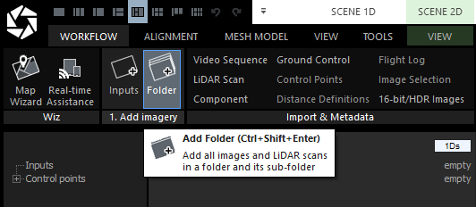
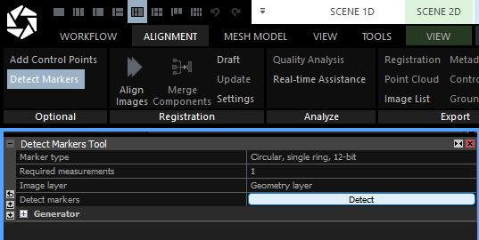
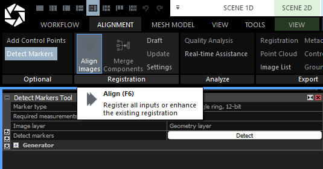
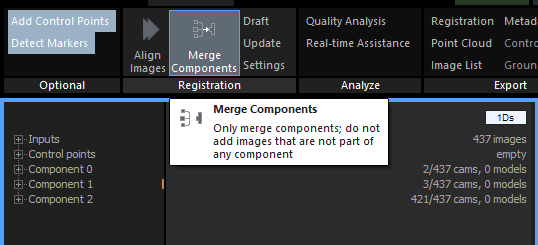
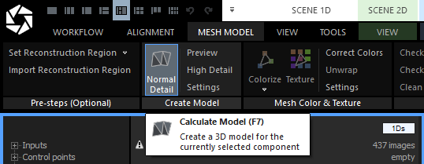
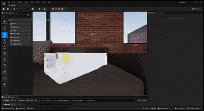

# 🧱 Reconstruct 3D Model with RealityScan

This guide walks you through creating a 3D model from your captured dataset using [RealityScan](https://www.realityscan.com/en-US), a powerful photogrammetry tool by Epic Games.

---

## 💻 Step 1: Install RealityScan

1. Download and install the **Epic Games Launcher**:  
   👉 https://store.epicgames.com/en-US/download

2. Use the launcher to install **RealityScan**.

3. (Optional) Review official tutorials:  
   📘 https://dev.epicgames.com/community/realityscan/getting-started/realityscan

---

## 📂 Step 2: Load Your Dataset

1. Open RealityScan and go to:  
   **Workflow → Folder**

2. Select the folder containing your `.tif` images from the dataset.

---

## 🎯 Step 3: Align Images

1. Go to the **Alignment** tab.
2. Click **Detect Markers**.
   
   

4. Click **Align Images**.  

   

---

## 🔁 Step 4: Merge Components with Control Points

Even with a clean dataset, RealityScan may place cameras into different components.

To solve this:

1. Manually add **Control Points** (visible in both components).

2. Once enough control points are placed, go to:  
   **Alignment → Merge Components**

      

If the model still has separate components, repeat by adding more control points until the full scene merges correctly.

---

## 🧱 Step 5: Generate the Mesh

Once all cameras are in a single component:

1. Switch to the **Mesh Model** tab

        
   
3. Click **Normal Detail** to generate geometry
4. Click **Texture** to apply surface color
5. Go to the right and click **Export → Dense Mesh Model**

This will save your 3D mesh and a diffuse texture map.

---

While the model includes a diffuse map, you'll need more textures (e.g. **Normal Map**, **Roughness**, **Ambient Occlusion**) for high-quality rendering in Unreal Engine.

➡️ **Next:** [Materialize](Materialize.md)
