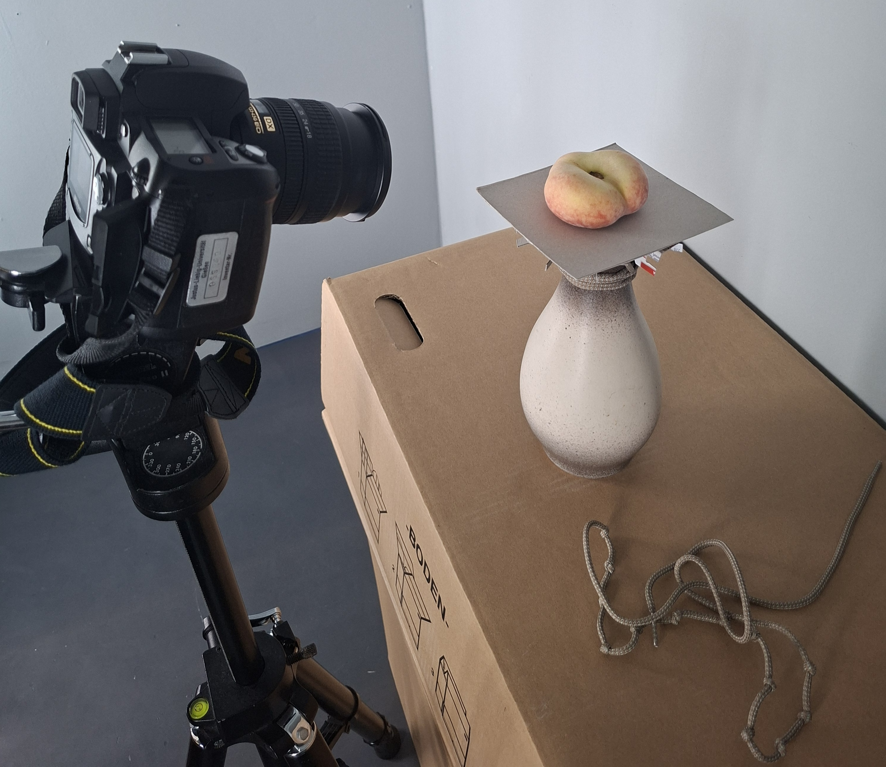

# 📷 Camera Setup Tutorial

This tutorial explains how to physically and digitally set up a DSLR camera for dataset collection using an Ubuntu system or Ubuntu virtual machine.

---

## 🧰 Requirements

- A DSLR camera (e.g. Nikon D70)
- USB cable to connect camera to the computer
- Ubuntu PC or Virtual Machine with USB passthrough enabled
- Camera mount or tripod

---

## 🖼️ Setup Camera Position

1. Place the camera on a tripod or fixed mount in the desired position for dataset collection.
2. Frame the scene to ensure:
   - The object is centered, and takes at least 70% of the frame
   - The background is consistent and uncluttered  
   - The lighting is stable (avoid direct reflections or flickering bulbs)
3. Connect the camera to your Ubuntu system using a USB cable.

📸 Example of the setup


---

## 🖥️ Setup Camera Parameters

### Step 1: Install Camera Control Dependencies

Navigate to the script folder and run:

```bash
cd controlCameraUbuntu/camera_installs
bash installs.sh
```

This installs:

- `gphoto2` (camera control)
- `exiftool` (for reading image metadata)
- `curl` (for remote communication, used later)

---

### Step 2: Set Camera Parameters via Script

Use the provided script to set ISO, aperture, and shutter speed remotely:

```bash
bash capchure_with_camera_parameters.sh
```

### What This Script Does

This script will:

- Kill conflicting camera services
- Set ISO, f-number, and shutter speed
- Capture an image and save it to your defined path
- Rename the file based on ISO, aperture, shutter speed, and timestamp

---

## ✅ Check Image Quality

After running the capture script, inspect the saved image. It should be:

- **Sharp** (focused on the object)
- **Well-exposed** (not too bright or too dark)

### ✔️ Good Example


### ❌ Bad Example


You can adjust the following parameters in the script and re-run it as needed:

- `ISO`
- `f-number`
- `shutterspeed`

---

## 🧪 Tips

- **Lower ISO** → Less noise, but requires better lighting
- **Wider aperture** (e.g. f/2.8) → More background blur (shallower depth of field)
- **Faster shutter speed** → Less motion blur

You can re-run `capchure_with_camera_parameters.sh` as many times as needed until the image looks good.

➡️ **Next:** [Set Up SwitchBot](setUpSwitchBot.md)
