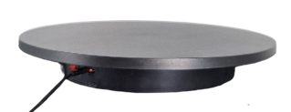

# 🤖 Set Up SwitchBot for Rotation Platform Control

This guide explains how to connect and configure your SwitchBot to press buttons on the remote control of the rotation platform illustrated below.



---
## 🧰 Requirements

- Python 3.7 or higher installed
- The following Python packages:
  - `switchbot_api` — to communicate with the SwitchBot
  - `asyncio` — (standard library, but required for async support)
  - `requests` or `curl` (for testing HTTP endpoints from terminal)

---

## 📱 Step 1: Install the SwitchBot App

Install the official SwitchBot app on your mobile device:

- **[Google Play Store](https://play.google.com/store/apps/details?id=com.theswitchbot.switchbot&hl=en&pli=1)**
- **[Apple App Store](https://apps.apple.com/de/app/switchbot/id1087374760)**

Open the app and:

1. Sign in or create an account.
2. Add your SwitchBot device.
3. Locate and copy the **MAC address** of your device by clicking in the app on the connected Bot and scrolling down to the Device info (you'll need it later).

---

## 💻 Step 2: Configure the `botApi.py` Script

1. Clone or navigate to the [ColourCorrect3DScan repository](https://github.com/sevenPetalFlower/ColourCorrect3DScan).
2. Open the file:  
   [`controlRemoteRotationPlatform/botApi.py`](https://github.com/sevenPetalFlower/ColourCorrect3DScan/edit/main/controlRemoteRotationPlatform/botApi.py)
3. Replace the line below with your actual MAC address:

```python
MAC_ADRESS = 'Put your Switch Bot Mac address' # <- replace this
```
Ensure the default password remains:

```python
bot.info.password_str = "0000"
```

You can change the password for the bot through SwitchBot app 

## ▶️ Step 3: Run and Test

### 1. Start the Bot API server

In the project directory, run:

```bash
python botApi.py
```

This will start a local HTTP server at:  
`http://localhost:8000`

---

### 2. Open a new terminal window and test the bot:

```bash
curl http://10.0.2.2:8000/connect
curl http://10.0.2.2:8000/press
curl http://10.0.2.2:8000/disconnect
```

✅ If everything works, the terminal will log the status of connection, press, and disconnection.

---

## 🧪 Troubleshooting

- Make sure **Bluetooth** is enabled on the device that hosts the script.
- Run in an environment where `switchbot_api` is installed:

```bash
pip install switchbot_api
```

- Ensure no other apps are using the SwitchBot while you're testing.

---

➡️ **Next:** [White balancing and Demosaicing with DCRAW](DCRAW_WhiteBalance_Demosaic.md)
